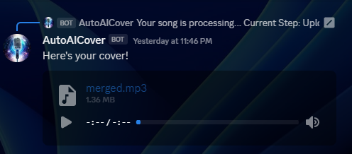

# Voice Changer Bot (AutoAICover)

## This is bad software!

SomeFolder
 - Retrieval-based-Voice-Conversion-WebUI
   - infer-web.py and other RVC files
 - voicechangerbot
   - finalCoverOutput
   - generatedVoice
   - instSeparated
   - musicDownloads
   - vocalSeparated
   - indexFiles
   - index.js and other files

Set up
1. All requirements of Retrieval-based-Voice-Conversion-WebUI fulfilled. (Conda environment, all dependencies installed)
2. npm install in the voicechangerbot directory.
3. create config.json with all fields filled out (see config.json.example)
4. Ensure all specified folders above exist
5. To add your own RVC model: Let's say the model is called "john" put john.pth here: `SomeFolder/Retrieval-based-Voice-Conversion-WebUI/weights/john.pth`
6. Put the index file here: `SomeFolder/voicechangerbot/indexFiles/john.index` The model and index names must match.
7. Add your new model as an option in `SomeFolder/voicechangerbot/commands/requestSong.js` for the voice StringOption and ensure the value matches the model and index file names.
8. npm run deployGlobal to deploy slash commands
9. npm run start to start the bot

I am monkey patching these two projects together, so it's gonna be messy. The RVC installation should not need tampering
with to get the project to work, but I might have forgotten a step I did over there to make it work. Hopefully not.
This project was developed on July 22nd, 2023. It should work with commit add253b of Retrieval-based-Voice-Conversion-WebUI.

To process a song, a new subprocess will start and attempt to activate the conda environment. This MUST succeed for the bot to work!